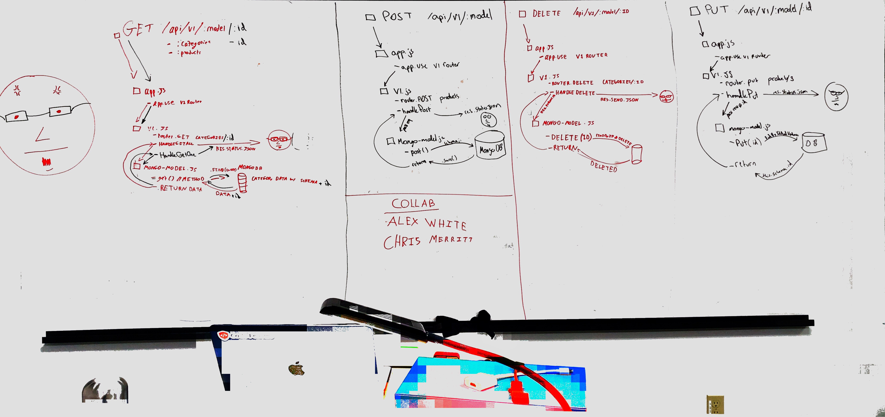

 LAB
=================================================

## Lab 9
### Chris Merritt
### Links and Resources
* [PR](https://github.com/401-advanced-javascript-merritt/lab-09/pull/1)

* [heroku]()

#### Documentation

* [swagger](https://lab9-merritt.herokuapp.com/api/v1/doc/)

* [jsdoc](https://lab9-merritt.herokuapp.com/docs/index.html)

### Setup
#### `.env` requirements
* Need to set the port (3000)
* Need to add the connection string to the MONGODB_URI

* `npm i`

#### Running the app
* `nodemon`
* Endpoint: `/`
* Endpoint: GET `api/v1/categories`
  * Returns a JSON object with all categories in it.
* Endpoint: POST `api/v1/categories/id`
  * Create a JSON object as a category.
* Endpoint: GET `api/v1/categories/id`
  * Get a JSON category at that id.
* Endpoint: Delete `api/v1/categories/id`
  * Returns a JSON object with all categories in it.

* Endpoint: GET `api/v1/player`
  * Returns a JSON object with all players in it.
* Endpoint: POST `api/v1/player/id`
  * Create a JSON object as a player.
* Endpoint: GET `api/v1/player/id`
  * Get a JSON player at that id.
* Endpoint: Delete `api/v1/player/id`
  * Returns a JSON object with all player in it.

#### Tests
* How do you run tests?
  * `npm run test`
  * `npm run lint`
* Need to make sure that the requests to the database are correct.
* Need to make sure that incorrect routes are handled.
* Need to make sure server errors are handled/
* Need to test validation of data.

#### UML
